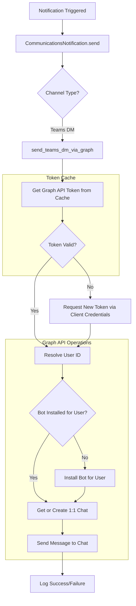
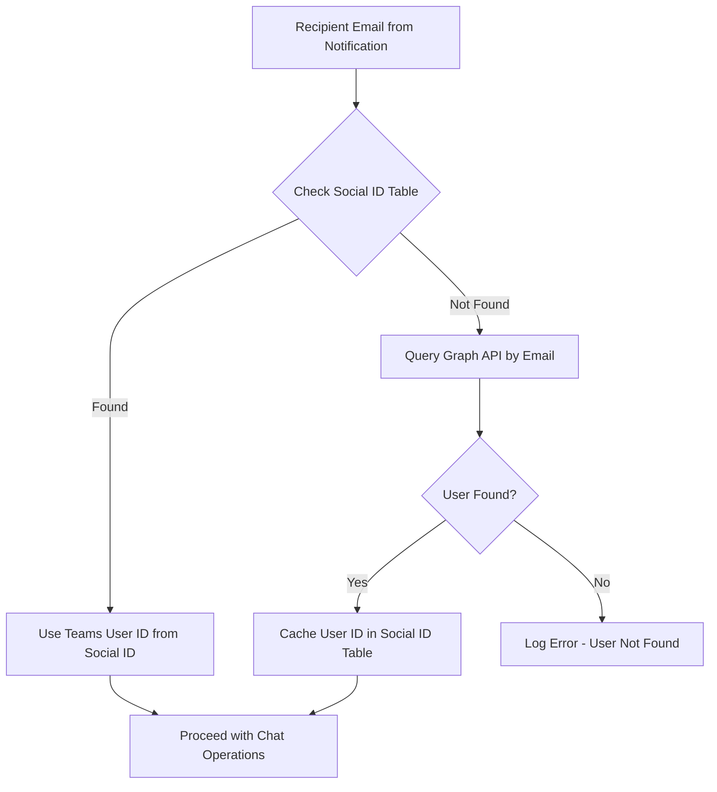

<!-- Copyright (c) 2026, AgriTheory and contributors
For license information, please see license.txt-->

# Teams DM via MS Graph API Integration Plan

> **Status**: Planning Complete - Ready for Implementation
> **Created**: 2026-03-02
> **Related Branch**: `~/redwood/apps/communications`

## Overview

This plan outlines the implementation of Microsoft Teams Direct Messages using MS Graph API with a **Teams Bot identity**. This approach provides a proper bot experience in Teams while avoiding the Bot Framework SDK dependency that is incompatible with Frappe's synchronous architecture.

## Current State Analysis

### Existing Implementation Issues
- Uses Bot Framework Connector API which requires conversation references
- Users must initiate conversation with bot before receiving DMs
- Stores conversation references in cache (ephemeral)
- Complex authentication flow with Bot Framework tokens
- Bot Framework SDK requires async/await patterns incompatible with Frappe

### Target State
- Use MS Graph API for direct messaging with Bot identity
- Bot appears as a proper Teams app/bot (not a user account)
- Application permissions allow proactive messaging
- Multi-layer user mapping:
  1. Primary: Email matching (ERPNext email = Azure AD/Teams email)
  2. Fallback: Social ID table on User doctype (stores external user IDs)
- Reuse existing 1:1 chats or create new ones as needed

## Key Architecture Decision: Bot Identity via Graph API

### Why Bot Identity vs Service Account?

| Aspect | Bot Identity | Service Account User |
|--------|--------------|---------------------|
| Teams Experience | Proper bot with bot icon/name | Appears as regular user |
| User Perception | Clear automation/bot | May confuse users |
| Permissions | Teams App permissions | User-level permissions |
| Chat History | Bot-specific chats | Mixed with user's chats |
| Management | Centralized bot management | Requires user account management |

### Bot Identity Requirements

1. **Azure Bot Service Registration**
   - Bot must be registered in Azure Bot Service
   - Bot must be associated with Azure AD app registration
   - Bot must be configured for Microsoft Teams channel

2. **Bot Installation for Users**
   - Bot must be installed for each user (personal scope) OR
   - Bot must be installed in a team where user is a member
   - Admin can deploy bot to all users via Teams admin center

3. **Graph API Permissions for Bot Messaging**
   - `Chat.ReadWrite.All` - Read/write all chats where bot is member
   - `Chat.Create` - Create new chats
   - `User.Read.All` - Read user profiles for email lookup

## Architecture



## MS Graph API Endpoints Required

### 1. Authentication
```
POST https://login.microsoftonline.com/{tenant_id}/oauth2/v2.0/token
```
- Grant Type: `client_credentials`
- Scope: `https://graph.microsoft.com/.default`

### 2. Find User by Email
```
GET https://graph.microsoft.com/v1.0/users/{userPrincipalName}
```
- Returns Azure AD user object with ID

### 3. Check/Install Bot for User
```
GET https://graph.microsoft.com/v1.0/users/{user-id}/teamwork/installedApps?$expand=teamsAppDefinition
```
- Check if bot app is installed for user

```
POST https://graph.microsoft.com/v1.0/users/{user-id}/teamwork/installedApps
{
    "teamsApp@odata.bind": "https://graph.microsoft.com/v1.0/appCatalogs/teamsApps/{app-id}"
}
```
- Install bot for user (requires admin consent)

### 4. Get Existing Chats with Bot
```
GET https://graph.microsoft.com/v1.0/chats?$filter=chatType eq 'oneOnOne' and members/any(x:x/userId eq '{user_id}')
```
- Find existing 1:1 chats between bot and user

### 5. Create 1:1 Chat with Bot
```
POST https://graph.microsoft.com/v1.0/chats
{
    "chatType": "oneOnOne",
    "members": [
        {
            "@odata.type": "#microsoft.graph.aadUserConversationMember",
            "roles": ["owner"],
            "user@odata.bind": "https://graph.microsoft.com/v1.0/users('{user_id}')"
        },
        {
            "@odata.type": "#microsoft.graph.aadUserConversationMember",
            "roles": ["owner"],
            "user@odata.bind": "https://graph.microsoft.com/v1.0/users('{bot_aad_id}')"
        }
    ]
}
```
Note: `{bot_aad_id}` is the Azure AD object ID of the bot's app registration

### 6. Send Message
```
POST https://graph.microsoft.com/v1.0/chats/{chat-id}/messages
{
    "body": {
        "content": "Message content here",
        "contentType": "html"
    }
}
```

## Required Azure AD Permissions

### Application Permissions (Admin Consent Required)
| Permission | Description |
|------------|-------------|
| `Chat.Create` | Create chats |
| `Chat.ReadWrite.All` | Read and write all chat messages |
| `User.Read.All` | Read user profiles for email lookup |
| `TeamsAppInstallation.ReadWriteSelfForUser.All` | Install bot for users |

## User Mapping Strategy

### Multi-Layer User Resolution



### Social ID Table Integration

Frappe's User doctype has a child table `Social ID` for storing external identity provider mappings:

```python
def get_teams_user_id(email: str) -> str | None:
    """Resolve Teams user ID using email and social ID table."""
    # 1. Check Social ID table first
    social_id = frappe.db.get_value(
        "Social ID",
        {"parent": email, "provider": "teams"},
        "userid"
    )
    if social_id:
        return social_id
    
    # 2. Fallback to Graph API lookup
    user = graph_client.get_user_by_email(email)
    if user:
        # Cache in Social ID table for future lookups
        create_social_id(email, "teams", user["id"])
        return user["id"]
    
    return None
```

### Social ID Table Structure
| Field | Value |
|-------|-------|
| `parent` | User email (ERPNext) |
| `provider` | `teams` |
| `userid` | Azure AD User ID (GUID) |
| `username` | User Principal Name (optional) |

## Implementation Details

### 1. Teams Webhook URL DocType Updates

Add new fields for Graph API configuration:

| Field | Type | Description |
|-------|------|-------------|
| `use_graph_api` | Check | Use Graph API instead of Bot Framework |
| `graph_tenant_id` | Data | Azure AD Tenant ID |
| `graph_client_id` | Data | Azure AD App Client ID |
| `graph_client_secret` | Password | Azure AD App Client Secret |
| `bot_app_catalog_id` | Data | Teams App Catalog ID for bot installation |
| `bot_aad_object_id` | Data | Azure AD Object ID of bot app registration |

### 2. New Graph API Service Module

Create `communications/communications/utils/teams_graph.py`:

```python
class TeamsGraphClient:
    """MS Graph API client for Teams bot operations."""
    
    def __init__(self, tenant_id: str, client_id: str, client_secret: str, 
                 bot_app_catalog_id: str = None, bot_aad_object_id: str = None):
        self.tenant_id = tenant_id
        self.client_id = client_id
        self.client_secret = client_secret
        self.bot_app_catalog_id = bot_app_catalog_id
        self.bot_aad_object_id = bot_aad_object_id
        self._token = None
        self._base_url = "https://graph.microsoft.com/v1.0"
    
    def get_token(self) -> str:
        """Get cached or new OAuth2 token."""
        pass
    
    def get_user_by_email(self, email: str) -> dict:
        """Look up Azure AD user by email."""
        pass
    
    def is_bot_installed_for_user(self, user_id: str) -> bool:
        """Check if bot is installed for user."""
        pass
    
    def install_bot_for_user(self, user_id: str) -> bool:
        """Install bot for user via Teams admin API."""
        pass
    
    def get_or_create_chat(self, user_id: str) -> str:
        """Find existing 1:1 chat with bot or create new one."""
        pass
    
    def send_message(self, chat_id: str, content: str, content_type: str = "html") -> dict:
        """Send message to Teams chat."""
        pass
```

### 3. Notification Override Updates

Update `send_a_teams_dm_msg` in `notification.py`:

```python
def send_a_teams_dm_msg(self, doc, context):
    """Send a direct message via Microsoft Teams using Graph API."""
    recipients, cc, bcc = self.get_list_of_recipients(doc, context)
    
    if not (recipients or cc or bcc):
        return
    
    recipients += cc + bcc
    
    teams_webhook_doc = frappe.get_doc("Teams Webhook URL", self.teams_webhook_url)
    
    if not teams_webhook_doc.use_graph_api:
        # Fallback to existing Bot Framework implementation
        self._send_teams_dm_bot_framework(doc, context, recipients)
        return
    
    graph_client = teams_webhook_doc.get_graph_client()
    
    for recipient in recipients:
        try:
            # Resolve user ID (Social ID table or Graph API)
            user_id = self.get_teams_user_id(recipient, graph_client)
            if not user_id:
                self.log_error(f"Teams user not found for email: {recipient}")
                continue
            
            # Ensure bot is installed for user
            if not graph_client.is_bot_installed_for_user(user_id):
                graph_client.install_bot_for_user(user_id)
            
            # Get or create chat
            chat_id = graph_client.get_or_create_chat(user_id)
            
            # Send message
            message = self._build_teams_message(doc, context, teams_webhook_doc)
            graph_client.send_message(chat_id, message)
            
        except TeamsGraphError as e:
            self.log_error(f"Failed to send Teams DM to {recipient}", e)
```

### 4. Caching Strategy

| Cache Key | TTL | Description |
|-----------|-----|-------------|
| `teams_graph_token:{client_id}` | 55 min | OAuth2 access token |
| `teams_user_id:{email}` | 24 hours | User ID lookup by email |
| `teams_chat_id:{user_id}:{bot_id}` | 1 hour | 1:1 chat ID cache |
| `teams_bot_installed:{user_id}` | 1 hour | Bot installation status |

### 5. Error Handling

```python
class TeamsGraphError(Exception):
    """Base exception for Teams Graph API errors."""
    pass

class UserNotFoundError(TeamsGraphError):
    """User not found in Azure AD."""
    pass

class BotNotInstalledError(TeamsGraphError):
    """Bot not installed for user."""
    pass

class ChatCreationError(TeamsGraphError):
    """Failed to create chat."""
    pass

class MessageSendError(TeamsGraphError):
    """Failed to send message."""
    pass
```

## File Changes Summary

| File | Action | Description |
|------|--------|-------------|
| `teams_webhook_url.json` | Modify | Add Graph API fields |
| `teams_webhook_url.py` | Modify | Add `get_graph_client()` method |
| `utils/teams_graph.py` | Create | New Graph API client module |
| `utils/__init__.py` | Create | Package init |
| `overrides/notification.py` | Modify | Update `send_a_teams_dm_msg` |

## Azure Setup Requirements

### 1. Azure AD App Registration
1. Create App Registration in Azure AD
2. Generate Client Secret
3. Add API Permissions:
   - `Chat.Create` (Application)
   - `Chat.ReadWrite.All` (Application)
   - `User.Read.All` (Application)
   - `TeamsAppInstallation.ReadWriteSelfForUser.All` (Application)
4. Grant Admin Consent

### 2. Azure Bot Service
1. Create Azure Bot resource
2. Configure Microsoft Teams channel
3. Link to Azure AD App Registration
4. Get Bot App ID and AAD Object ID

### 3. Teams App Package
1. Create Teams app manifest
2. Upload to Teams App Catalog
3. Get App Catalog ID for programmatic installation

## Azure Configuration Validation Script

Create a diagnostic script to validate Azure Bot Service configuration early in development:

### Script: `communications/utils/validate_azure_setup.py`

```python
"""
Azure Bot Service Configuration Validator

Run this script to validate your Azure setup:
    bench execute communications.utils.validate_azure_setup.validate --args '["Teams Webhook URL Name"]'
"""

import requests
import frappe

def validate(teams_webhook_name: str):
    """Validate Azure Bot Service configuration for Teams DM."""
    results = []
    
    # 1. Load configuration
    webhook = frappe.get_doc("Teams Webhook URL", teams_webhook_name)
    results.append(("Config Load", "PASS", f"Loaded: {webhook.webhook_name}"))
    
    # 2. Test OAuth2 Token Acquisition
    token_url = f"https://login.microsoftonline.com/{webhook.graph_tenant_id}/oauth2/v2.0/token"
    data = {
        "grant_type": "client_credentials",
        "client_id": webhook.graph_client_id,
        "client_secret": webhook.get_password("graph_client_secret"),
        "scope": "https://graph.microsoft.com/.default",
    }
    
    try:
        response = requests.post(token_url, data=data)
        response.raise_for_status()
        token = response.json()["access_token"]
        results.append(("Token Acquisition", "PASS", "Successfully obtained access token"))
    except Exception as e:
        results.append(("Token Acquisition", "FAIL", str(e)))
        return results  # Cannot continue without token
    
    headers = {"Authorization": f"Bearer {token}", "Content-Type": "application/json"}
    
    # 3. Test User.Read.All Permission
    try:
        # Try to get a test user (first user in tenant)
        response = requests.get(
            "https://graph.microsoft.com/v1.0/users?$top=1",
            headers=headers
        )
        response.raise_for_status()
        users = response.json().get("value", [])
        if users:
            test_user = users[0]
            results.append(("User.Read.All", "PASS", f"Found user: {test_user.get('userPrincipalName')}"))
        else:
            results.append(("User.Read.All", "WARN", "No users found in tenant"))
    except Exception as e:
        results.append(("User.Read.All", "FAIL", str(e)))
    
    # 4. Test Chat Permissions (list existing chats)
    try:
        response = requests.get(
            "https://graph.microsoft.com/v1.0/chats?$top=1",
            headers=headers
        )
        response.raise_for_status()
        chats = response.json().get("value", [])
        results.append(("Chat.Read.All", "PASS", f"Found {len(chats)} chats"))
    except Exception as e:
        results.append(("Chat.Read.All", "FAIL", str(e)))
    
    # 5. Validate Bot App Catalog ID
    if webhook.bot_app_catalog_id:
        try:
            response = requests.get(
                f"https://graph.microsoft.com/v1.0/appCatalogs/teamsApps/{webhook.bot_app_catalog_id}",
                headers=headers
            )
            response.raise_for_status()
            app_info = response.json()
            results.append(("Bot App Catalog", "PASS", f"App: {app_info.get('displayName', 'Unknown')}"))
        except Exception as e:
            results.append(("Bot App Catalog", "FAIL", f"App ID invalid or not found: {e}"))
    else:
        results.append(("Bot App Catalog", "WARN", "No App Catalog ID configured"))
    
    # 6. Validate Bot AAD Object ID
    if webhook.bot_aad_object_id:
        try:
            response = requests.get(
                f"https://graph.microsoft.com/v1.0/directoryObjects/{webhook.bot_aad_object_id}",
                headers=headers
            )
            response.raise_for_status()
            obj_info = response.json()
            results.append(("Bot AAD Object", "PASS", f"Type: {obj_info.get('@odata.type', 'Unknown')}"))
        except Exception as e:
            results.append(("Bot AAD Object", "FAIL", f"Object ID invalid: {e}"))
    else:
        results.append(("Bot AAD Object", "WARN", "No AAD Object ID configured"))
    
    # 7. Test Bot Installation Permission
    try:
        # This requires TeamsAppInstallation.ReadWriteSelfForUser.All
        # We will just check if we can query the endpoint
        if users:
            test_user_id = users[0]["id"]
            response = requests.get(
                f"https://graph.microsoft.com/v1.0/users/{test_user_id}/teamwork/installedApps",
                headers=headers
            )
            response.raise_for_status()
            results.append(("Bot Installation API", "PASS", "Can query installed apps"))
    except Exception as e:
        results.append(("Bot Installation API", "FAIL", str(e)))
    
    return results


def print_results(results):
    """Print validation results in a formatted table."""
    print("\n" + "=" * 60)
    print("Azure Bot Service Configuration Validation")
    print("=" * 60)
    
    for test_name, status, message in results:
        status_icon = "✓" if status == "PASS" else "✗" if status == "FAIL" else "⚠"
        print(f"\n{status_icon} {test_name}: {status}")
        print(f"  {message}")
    
    print("\n" + "=" * 60)
    
    # Summary
    passes = sum(1 for _, s, _ in results if s == "PASS")
    fails = sum(1 for _, s, _ in results if s == "FAIL")
    warns = sum(1 for _, s, _ in results if s == "WARN")
    
    print(f"Summary: {passes} passed, {fails} failed, {warns} warnings")
    print("=" * 60 + "\n")
```

### Validation Checklist

| Check | Purpose | Required Permission |
|-------|---------|-------------------|
| Token Acquisition | Verify client credentials work | None (OAuth2) |
| User.Read.All | Find users by email | `User.Read.All` |
| Chat.Read.All | List existing chats | `Chat.Read.All` |
| Bot App Catalog | Validate bot app exists | `AppCatalog.Read.All` |
| Bot AAD Object | Validate bot identity | `User.Read.All` |
| Bot Installation API | Install bot for users | `TeamsAppInstallation.ReadWriteSelfForUser.All` |

## Testing Strategy

1. **Unit Tests**: Mock Graph API responses, test client methods
2. **Integration Tests**: Test against Azure AD test tenant
3. **Error Cases**: Test user not found, token expiry, rate limits, bot not installed

## Migration Path

1. Deploy new code with `use_graph_api` flag defaulting to false
2. Configure Graph API credentials in Teams Webhook URL
3. Enable `use_graph_api` checkbox
4. Existing Bot Framework implementation remains as fallback

## Security Considerations

1. Client secrets stored in Frappe Password field (encrypted)
2. Tokens cached with appropriate TTL
3. Minimal permissions requested (principle of least privilege)
4. Audit logging for all message sends
5. Bot installation requires admin consent (controlled deployment)
